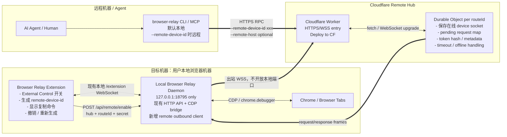
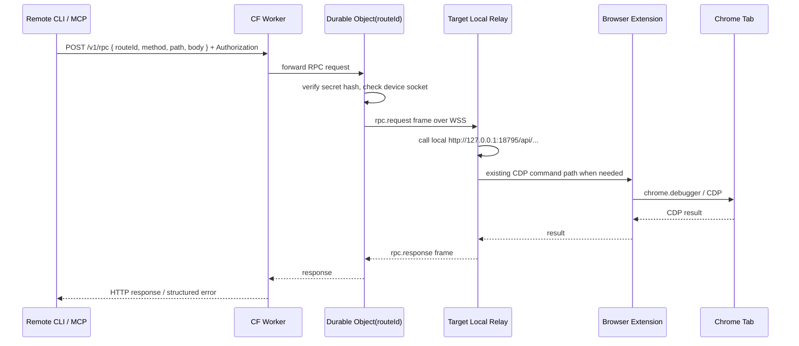

# Browser Relay Remote Control Hub 架构与施工草案

> **已落地实现(2026-07)**:本文是最初的「方案 B」草案(本地 relay daemon 出站连 Hub)。**实际实现改为「方案 A」**——浏览器插件**直接**连 Hub,并在插件内用 `chrome.debugger` 自己执行命令,本地 relay daemon 不参与远程。Hub = Cloudflare Worker + Durable Object,`secretHash` **仅存内存、不落盘**(设备断开即随 DO 回收)。Capability 为紧凑的 `br-<secret>`(见下方「Capability 格式」)。下文的 daemon 出站流程仅作存档参考。

## 目标

把远程控制从“本地机器暴露 `0.0.0.0:18795` + HTTP token”改成“浏览器端授权 + 本地 daemon 出站连接 + Cloudflare Hub 转发”。

核心原则：

- 默认本地控制不变：`browser-relay tabs` 仍然控制 `127.0.0.1:18795`。
- 浏览器插件是远程控制授权入口；CLI 不做 login、不注册设备。
- 用户在插件里显式打开 External Control，插件动态生成 capability-style `remote-device-id`。
- 本地 relay daemon 只监听本机，并主动通过 WSS 连接 Hub；不要求绑定 `0.0.0.0`，不要求路由器端口转发。
- CLI/MCP 只有传 `--remote-device-id` / `BROWSER_RELAY_REMOTE_DEVICE_ID` 时才走远程。
- Hub 可用默认官方服务，也必须支持用户一键部署到 Cloudflare Worker + Durable Object。

---

## 总体架构图



---

## 组件职责

| 组件 | 职责 | 明确不做 |
|---|---|---|
| Browser Extension | 用户打开/关闭远程控制；生成和保存 `remote-device-id`；把 hub/route/secret 下发给本地 daemon；显示复制命令和连接状态 | 不让 CLI login；不直接暴露本地端口 |
| Local Relay Daemon | 保持现有本地 HTTP API；保持 extension/CDP bridge；远程开启后主动连 Hub；把 Hub 转来的请求转发到本机 API | 不绑定公网；不实现账号系统 |
| Cloudflare Hub | Worker + Durable Object；接收 device 出站 WSS；接收 CLI HTTPS 请求；按 routeId 转发；返回结构化错误 | 不做浏览器自动化逻辑；MVP 不做用户账号 |
| CLI / MCP | 默认走本地；传 `--remote-device-id` 时解析 capability 并调用 Hub；`--remote-host` 可选 | 不 login；不注册设备；不保存用户账号 |

---

## 用户体验

### 本地试用 MVP

当前本地 MVP 先提供一个 Node 版 Hub，方便在 Cloudflare Worker 落地前跑通链路：

```bash
# 终端 1：从当前 checkout 启动本地 hub
BROWSER_RELAY_HUB_PORT=18796 npm run hub

# 终端 2：启动/重启本地 relay
browser-relay restart
```

然后打开扩展 Options：

1. `Remote Hub` 填 `http://127.0.0.1:18796`。
2. 点击 `Enable External Control`。
3. 复制生成的 `remote-device-id`。
4. 在任意终端测试：

```bash
node server/cli.js debug \
  --remote-device-id brd1_xxx \
  --remote-host http://127.0.0.1:18796 \
  --json
```

这条链路已经不是直接打本地 relay 端口，而是：CLI -> Hub -> 本地 relay 出站 WSS -> 本地 API。

### 本地模式，不变

```bash
browser-relay tabs
browser-relay click '#submit'
browser-relay network --limit 50
```

默认仍然调用：

```text
http://127.0.0.1:18795
```

### 开启远程控制

用户在插件 popup/options 里操作：

```text
External Control: Off
Remote Host: https://relay.linso.ai
[Enable External Control]
```

启用后插件生成高熵 capability，并显示：

```text
External Control: On
Remote Device ID:
brd1_xxxxxxxxxxxxxxxxxxxxxxxxxxxxxxxxxxxxxxxxxxxxxxxxx

Copy command:
browser-relay tabs --remote-device-id brd1_xxxxxxxxxxxxxxxxxxxxxxxxxxxxxxxxxxxxxxxxxxxxxxxxx
```

自部署 Hub 时：

```bash
browser-relay tabs \
  --remote-device-id brd1_xxxxxxxxxxxxxxxxxxxxxxxxxxxxxxxxxxxxxxxxxxxxxxxxx \
  --remote-host https://browser-relay-hub.username.workers.dev
```

MCP 环境变量：

```bash
BROWSER_RELAY_REMOTE_DEVICE_ID=brd1_xxxxxxxxxxxxxxxxxxxxxxxxxxxxxxxxxxxxxxxxxxxxxxxxx
BROWSER_RELAY_REMOTE_HOST=https://browser-relay-hub.username.workers.dev
browser-relay-mcp
```

---

## Capability 格式

`remote-device-id` 不是普通公开 ID，而是 capability。知道它的人就有控制权限，所以 UI 和文档都必须标注“像密码一样保管”。

最终格式（已实现）：

```text
br-<secret>
```

- `br`：版本前缀。
- `secret`：随机授权密钥（96-bit，base64url，16 字符），用于 device/CLI 鉴权。
- `routeId`（Worker 用来定位 Durable Object）**不放进 id**，而是从 secret 派生：`routeId = base64url(SHA-256(secret))` 取前 16 字符。CLI（Node crypto）与插件（SubtleCrypto）用同一算法派生，落到同一个 DO。

于是整个 capability 只有约 19 字符，例如 `br-G1PMrqZmTckQP63P`。

Hub 只在**内存**里保存 `SHA-256(secret)`（设备在线期间），不存明文、不落盘 —— 设备断开、DO 回收即清空，不留僵尸路由。

---

## 远程启用流程

```mermaid
sequenceDiagram
  participant User as User
  participant Ext as Browser Extension
  participant Relay as Local Relay Daemon
  participant Hub as CF Worker
  participant DO as Durable Object

  User->>Ext: Enable External Control
  Ext->>Ext: generate routeId + secret
  Ext->>Hub: WSS /v1/device/connect?routeId=...
  Ext->>Hub: device.auth { secret }
  Hub->>DO: route to DO(routeId)
  DO->>DO: first-writer claim or verify secret hash
  DO-->>Ext: device.authenticated
  Ext->>Ext: send device.hello; mark connected
  Ext-->>User: show remote-device-id and copy command
```

说明：

- 插件负责生成和保存 capability。
- daemon 负责维持出站 WSS；如果断线，daemon 自动重连。
- 如果 daemon 重启，插件可以在下次启动/keepalive 时重新下发 remote config；也可以让 daemon 把 remote config 存到用户本地配置文件。MVP 优先用 daemon 本地配置，插件禁用时调用 revoke/disable。

---

## 远程命令流程



CLI 不需要打开本地 proxy，也不需要 login；每个命令就是一次 HTTPS RPC 到 Hub。之后如果需要长连接/流式日志，再加 WSS client 模式。

---

## Cloudflare Hub 形态

目录建议：

```text
hub/
  package.json
  wrangler.toml
  src/
    index.ts              # Worker entry
    device-object.ts      # Durable Object
    protocol.ts           # frame/schema helpers
    crypto.ts             # hash / timing-safe compare / future E2EE helpers
  README.md               # self-host 部署说明
```

Cloudflare 资源：

```text
Worker
  - GET /                      health / docs landing
  - GET /v1/health             JSON health
  - GET /v1/device/connect     WebSocket upgrade for local relay daemon
  - POST /v1/rpc               CLI/MCP request entry
  - GET /v1/status/:routeId    optional device online status

Durable Object
  - one object per routeId: env.DEVICES.idFromName(routeId)
  - holds current device WebSocket
  - stores secret hash and metadata
  - maps request id -> resolver
  - enforces request timeout
```

一键部署按钮：

```md
[](https://deploy.workers.cloudflare.com/?url=https://github.com/reliefeai/browser-relay/tree/main/hub)
```

自部署后，用户把 Worker URL 填入插件：

```text
https://browser-relay-hub.username.workers.dev
```

---

## 协议草案

### Device connect

```http
GET /v1/device/connect?routeId=<routeId>
Upgrade: websocket
```

WebSocket 打开后，device 必须先发认证帧。secret 不进入 URL，避免被 CDN、代理或请求日志记录：

```json
{ "type": "device.auth", "secret": "..." }
```

Hub 验证成功后回复：

```json
{ "type": "device.authenticated" }
```

只有收到认证成功帧后，device 才发 hello，并把连接标记为 connected：

```json
{
  "type": "device.hello",
  "version": "1.0.17",
  "routeId": "...",
  "deviceName": "Liu's Mac",
  "capabilities": ["tabs", "snapshot", "click", "type", "screenshot", "console", "network"]
}
```

认证前发送 `device.hello` 或 `rpc.response` 会被拒绝并关闭；未在限时内认证的连接也会关闭。Hub 为先部署兼容，暂时接受旧版 `?token=` 客户端；新扩展不保留查询参数回退。

### CLI RPC

```http
POST /v1/rpc
Authorization: Bearer <secret>
Content-Type: application/json
```

```json
{
  "routeId": "...",
  "id": "req_...",
  "method": "GET",
  "path": "/api/tabs",
  "headers": {},
  "body": null
}
```

Hub 转发给 device：

```json
{
  "type": "rpc.request",
  "id": "req_...",
  "method": "GET",
  "path": "/api/tabs",
  "headers": {},
  "body": null
}
```

Device 返回：

```json
{
  "type": "rpc.response",
  "id": "req_...",
  "status": 200,
  "headers": { "content-type": "application/json" },
  "body": { "ok": true, "tabs": [] }
}
```

### 结构化错误

设备离线：

```json
{
  "ok": false,
  "code": "remote_device_offline",
  "message": "Remote Browser Relay device is offline",
  "status": 409,
  "retryable": true
}
```

capability 无效：

```json
{
  "ok": false,
  "code": "invalid_remote_device",
  "message": "Invalid or revoked remote device id",
  "status": 401,
  "retryable": false
}
```

远程超时：

```json
{
  "ok": false,
  "code": "remote_request_timeout",
  "message": "Remote device did not respond before timeout",
  "status": 504,
  "retryable": true
}
```

---

## 安全边界

MVP 安全模型：

- 本地 relay 不暴露公网，只监听 `127.0.0.1`。
- 本地 daemon 主动出站连接 Hub，使用 WSS/HTTPS。
- `remote-device-id` 是 capability，必须高熵、可撤销、可重新生成。
- Hub 不存明文 secret，只存 hash。
- Hub 认证时重新派生并验证 `routeId === base64url(SHA-256(secret)).slice(0,16)`；仅知道 routeId 不能抢占离线设备。
- 认证失败响应与日志不得包含 secret。
- CLI 不保存账号态；有 capability 才能控制。
- 插件 UI 必须提供 Disable / Regenerate。

MVP 仍然是 trusted Hub：

- 自部署 Cloudflare Hub：用户信任自己的 Worker。
- 官方默认 Hub：MVP 可先跑通，但隐私上不完美；后续应做 E2EE blind relay。

后续 E2EE 方向：

- `secret` 派生两类 key：auth proof key + payload encryption key。
- Hub 只看 `routeId`、请求 id、长度、时间；看不到 `/api/snapshot`、screenshot、console/network 内容。
- Worker 只做密文转发，device 和 CLI 端到端加密 request/response payload。

---

## 简略施工计划

### Phase 0：协议和文档落地

- 新增本文档。
- 把 Issue #3 从“公网 token 鉴权”改为“Remote Control Hub / no local port exposure”。
- 明确不做 CLI login、不要求用户绑定 `0.0.0.0`。

### Phase 1：Cloudflare Hub MVP

实现 `hub/`：

- Worker entry：health、device connect、RPC entry。
- Durable Object：保存在线 device socket、secret hash、pending requests。
- `wrangler.toml` + DO migration。
- 一键部署按钮文档。
- 单元测试：
  - device connect first claim。
  - wrong secret rejected。
  - CLI RPC when device offline returns `remote_device_offline`。
  - CLI RPC routes to live device and returns response。
  - timeout returns `remote_request_timeout`。

### Phase 2：Local Relay remote outbound client

改 `server/relay-server.js`：

- 新增 `/api/remote/enable`、`/api/remote/disable`、`/api/remote/status`。
- remote enable 后建立 outbound WSS 到 Hub。
- 收到 `rpc.request` 后，调用本机现有 HTTP API 路由并返回 `rpc.response`。
- 自动重连、心跳、状态记录。
- 禁用时关闭 WSS 并清理本地配置。

测试：

- fake Hub WebSocket 下发 `/api/tabs`，local relay 返回真实 API 结果。
- disable 后 WSS 关闭，status 显示 off。
- Hub 断线后自动重连。

### Phase 3：Extension UI 授权入口

改 extension popup/options：

- 增加 External Control 区块。
- Remote Host 输入框，默认官方 Hub。
- Enable 时生成 `routeId` + `secret`，调用本地 `/api/remote/enable`。
- 显示 `remote-device-id` 和复制命令。
- Disable / Regenerate。
- 显示 online/offline 和 active session 简略状态。

测试：

- options/popup 源码静态测试：确保生成 capability、调用 `/api/remote/enable`，不出现 CLI login 文案。
- 手工浏览器验证：开关、复制命令、禁用撤销。

### Phase 4：CLI / MCP remote flags

改 `server/cli.js`：

- 全局参数：
  - `--remote-device-id <brd1_...>`
  - `--remote-host <url>` optional，默认官方 Hub。
- 环境变量：
  - `BROWSER_RELAY_REMOTE_DEVICE_ID`
  - `BROWSER_RELAY_REMOTE_HOST`
- 当 remote-device-id 存在时，`relayRequest` 走 Hub `/v1/rpc`；否则保持本地 `RELAY_URL`。
- CLI help 里说明 capability 是 secret。

改 `server/mcp-server.js`：

- 读取同样环境变量。
- remote 模式下所有工具通过 Hub RPC。

测试：

- 未传 remote-device-id 时仍调用本地。
- 传 remote-device-id 时请求 Hub，method/path/body 正确。
- remote structured error 在 CLI `--json` 和 MCP `isError` 中保留。

### Phase 5：README / 中文 README / bundled skill

更新：

- 本地模式不变。
- 远程模式推荐流程：插件启用 -> 复制 command -> CLI 使用。
- Cloudflare 一键部署。
- `remote-device-id` 安全说明。
- 不推荐 `0.0.0.0` 裸暴露。

### Phase 6：E2EE blind relay

- 定义 `brd2_` capability 格式。
- CLI 和 local relay 使用 WebCrypto / Node crypto 派生 key。
- Hub 只路由密文 envelope。
- 增加兼容：`brd1_` trusted hub，`brd2_` E2EE hub。

---

## 不做项

- 不做 CLI login。
- 不做账号系统作为 MVP 前置条件。
- 不做公网 HTTP 直连本地 relay。
- 不做 lightweight locator。
- 不在第一版做复杂权限 scope；先以 capability + 浏览器显式开关 + revoke/regenerate 保证闭环。
- 不把 Cloudflare Hub 写死；默认 host 可用，但 self-host 必须是一等路径。
